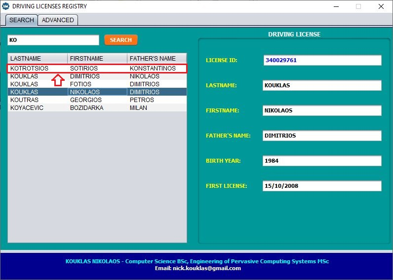
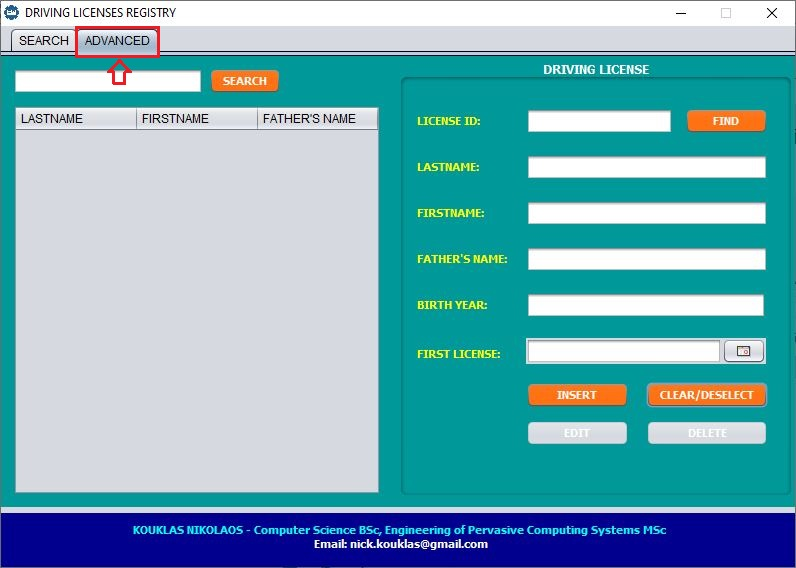
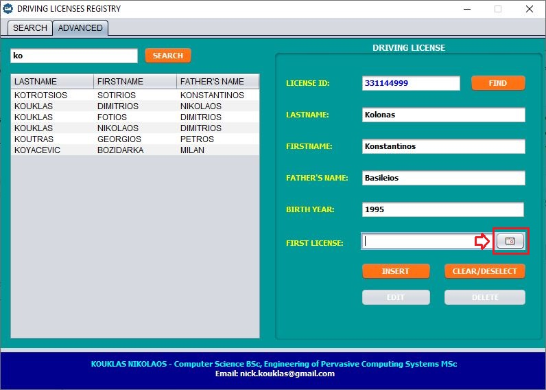
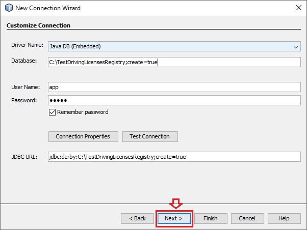

# **A SIMPLE JAVA DESKTOP APPLICATION FOR DRIVING LICENSES REGISTRY**

# Contents
* [A short technical description and the purpose of the application](#anchor1)
* [Application usage instructions](#anchor2)
* [Download project from Github](#anchor3)
* [Import project into Netbeans](#anchor4)
* [How to create a new JavaDB database in embedded mode](#anchor5)
* [How to create the table for the database of this application](#anchor6)
* [Connecting the project with the database](#anchor7)
* [How create an .EXE installer file through NetBeans for installing the application on Windows](#anchor8)

#  A Short technical description and the purpose of the application
It's about a Java Desktop Application which has been built especially for the internal purposes of the Driving Licenses Department of the Transport and Communications Directorate of Trikala's Regional Unit. It contains all the basic CRUD functionalities for recording and searching for information about driving licenses.

These main functionalities are:
- Searching for driving licenses records by the driver's Lastname or by the License Id.
- Inserting new driving licenses records.
- Updating or deleting existing driving licenses records.

The application plays an assisting role against the central online system of driving licenses, as it keeps driving licenses records for a few specific years that have not been recorded in the central system.

Java DB (Derby) Database is being used for storing the records and is connected with the application through the ["Embedded Driver"](http://aparna-java.blogspot.com/2011/11/good-day-all.html?m=1). Note that [Java DB](https://netbeans.org/kb/docs/ide/java-db.html) is a database server which is included in the JDK. Finally, the application has been developed with JDK7 (version 1.7.0 Update_80 32-bit) in NetBeans IDE (version 8.0.2 32-bit).

---
#  Application Usage Instructions

## The menu consists of two tabs: A) "SEARCH" tab, and B) "ADVANCED" tab.

### A) "SEARCH" tab
Through the "SEARCH" tab, a user can search for a driving license record by writing the lastname of the driver or at least some of the first letters of his lastname. The images below describe step-by-step this simple functionality:

1. User first clicks the "SEARCH" button of this tab.

2. Then inserts in the text box the lastname of the driver or at at least some of the first letters of his lastname. The text which will be inserted is case-insensitive. This means that it does not matter whether the letters are uppercase or lowercase so as to find the requested record. Also note that white spaces at the beginning and at the end of this box's text field are ommitted.

3. Clicks the "SEARCH" button.

4. The results are displayed with capital letters in a table by ascending order of the "LASTNAME" field. Furthermore, the "FIRSTNAME" and "FATHER'S NAME" fields of each record are displayed in the table to recognize the desired driver. The user has to click the desired line in the table so as to see more details about this record.

5. Then, the details of the selected record are displayed on the right side inside the "DRIVING LICENSE" panel.

6. If the user wishes to see the details of another driver's record, he has to select the corresponding line in the table by clicking on it.

7. Moreover, in case the user wants to search for a record with another keyword, he writes the new keyword to the text box, clicks again the "SEARCH" button, and selects the corresponding line in the table when the results are displayed.

8. Finally, in case no record is found with the specified keyword, then a related message is displayed on the screen.

---
### B) "ADVANCED" tab
Through the "ADVANCED" tab, a user has the following choices:

#### i) Search for a driving license record by inserting the "LASTNAME" of the driver.
This choice provides the same functionality as does the corresponding one in the "SEARCH" tab. The only thing the user has to do is to click on the button of the "ADVANCED" tab and then follow the same steps to search for a record by driver's lastname as it was presented in the "SEARCH" tab.

#### ii) Find a driving license record by inserting the "LICENSE ID" of the driver.

1. The user has to insert the license id of the driver in the appropriate text field and then click the "FIND" button.

2. In case a record exists with that license id, detailed information about this record is displayed to all the remainder text fields of the "DRIVING LICENSE" panel, such as lastname, firstname, birth year, etc. Also, note that this fetched record is now considered as 'selected' and the user will have to click "CLEAR/DESELECTED" button to deselect it. Additionally, remember that when a record has been selected, we can edit or delete it by clicking on the corresponding buttons, whose functionalities will be presented later.

3. After the user has clicked the "CLEAR/DESELECTED" button, all the text fields of "DRIVING LICENSE" panel are cleared and that record is now considered as 'deselected'.

4. As a result the user has now the ability to insert a new license id, click again the "FIND" button and if such a record exists, its details are displayed.

5. Otherwise, when a record is not found with the specified license id, an appropriate message appears on the screen. The user has also to click the "OK" button of the emerged window so as to continue.

#### iii) Insert a new driving license record
Let's suppose, we have already searched for records that their 'lastname' field starts from the keyword "ko" and and we are on the screen below.

1. If the user wants to insert a new driving license record, he has first to fill all the following fields (which are necessary) of the "DRIVING LICENSE" panel:
 * *LICENSE ID*: A positive integer.
 * *LASTNAME**: A string that contains only letters.
 * *FIRSTNAME**: A string that contains only letters.
 * *FATHER'S NAME**: A string that contains only letters.
 * *BIRTH YEAR*: A positive short integer.
 * *FIRST LICENSE*: A date in 'dd/MM/yyyy' format.

 **The white spaces at the beginning and at the end of these fields are ommitted*

2. With regard to "FIRST LICENSE" field the user has two choices to insert a date:
 * Either manually by inserting a valid date as text in 'dd/MM/yyyy' format

 * Or by using the date picker as is presented below.

3. Finally, the user has to click the "INSERT" button to insert the new record.

4. If the record has been inserted successfully, a related message appears on the screen as shown below. Otherwise, if at least one field is empty or invalid, then a related error message appears on the screen:

5. A new record line may also appear in the table (on the left), if the search keyword that the user inserted before matches with the 'lastname' field of the new record.

6. In the following screenshots, you can see some error messages which appear on the screen  whenever a user tries to insert a new record with at least one empty or invalid field.

According to the requirements of this application, each driving license record must have a unique license id.

#### iv) Edit an existing driving license record.
1. Let's suppose, we have already searched for records that their 'lastname' field starts from the keyword "ko" and and we are on the screen below. If a user wishes to edit an existing record, he has first to select it. So, he must click on the appropriate line in the table on the left side.

2. After the details of the selected record have been displayed inside the "DRIVING LICENSE" panel on the right side, the user can edit/modify the desired field or fields. E.g. We suppose we want to modify the "BIRTH YEAR" field of the selected record from '1995' to '1994'.

3. The next step is to click on the "EDIT" button.

4. If the record has been modified successfully, a related message appears on the screen as shown below. The user has to click on the "OK" button to continue.

5. In the following screenshots, you can see some error messages which appear on the screen whenever a user tries to edit an existing record with at least one empty or invalid field.

#### v) Delete an existing driving license record.
1. Select the record you wish to delete by clicking on the appropriate line of the table.

2. After the desired record has been selected, you can delete it by clicking on the "DELETE" button.

3. Then a message appears on the screen, which asks you to confirm whether you wish to delete this record. If you are sure, you can click on the "YES" button and the record is deleted permanently. Otherwise, if you are not sure, you can click on the "NO" button and the procedure is canceled.

#  Download Project from Github
Download the project as a .zip file by pressing the "DOWNLOAD ZIP" button on this project's repository page in Github (as is shown below).

#  Import Project into Netbeans
To import the project you downloaded before as .zip file from Github, go to your Netbeans IDE and follow the next menu path: File -> Import Project -> From ZIP. Then browse (see next image) and select the location of the project's zip file that you've downloaded on your computer to import it into NetBeans.

#  How to create a new JavaDB Database in Embedded Mode
1. Open Netbeans IDE and select the "Services" tab.

2. Right click on Databases and select "New Connection".

3. In the new windows that appears select "Java DB (Embedded)" as Driver and then click "Next".

4. Then, in the next window, fill in the form as shown below. First fill in the the path and the name of the database (e.g., C:\TestDrivingLicensesRegistry) and next to it write the parameter "create=true" separated by a semicolon (;). This parameter is needed to create the database the first time. Also, give a username and a password which are required for connecting to the database with the "Remember password" choice checked. Finally, click "Next" to proceed.

5. In the following screen,  click "Next" (leave the "APP" choice as it is).

6. Click "Finish".

7. Now, we can see the new database connection which has been created.

8. Right click on this connection, select "Rename", give any name you wish (e.g., TestDrivingLicensesRegistry) and click "OK".

9. Yet again right click on the connection and select "Properties".

10. Then, click on the small icon on the right side of "Database URL" line, as is shown below.

11. We remove the ";create=true" parameter, click "OK" twice, and then "Close".

#  How to create the table for the database of this application

1. In the "Services" tab, open again the connection, and click the (+) buttons successively by following the path TestDrivingLicensesRegistry -> APP -> Tables.
2. Right click on the "Tables" icon and click "Execute Command".
3. Next, insert the appropriate SQL code (as is presented below) so as to create the required table and index for this application's database.
4. Finally, to execute that SQL code, click on the "Run SQL" icon (as shown below). In the end, do not forget to close the connection.

#  Connecting the project with the database
1. In the "Projects" tab, click the plus (+) buttons successively by following the path DrivingLicensesRegistry (English version) -> Source Packages -> META_INF.
2. Double click on the "persistence.xml" file and select the "jdbc:derby:C:\TestDrivingLicensesRegistry [app on APP]" choice for JDBC Connection.
3. Once saving this choice with Ctrl+S, close the tab of the "persistence.xml" file and select the "DrivingLicensesRegistry (English version)" line in this "Projects" tab.
4. Go to Window -> Output and click on it to display the "Output" tab.
5. Click on "Clear and Built Project" button.
6. Now, you can "Run Project" button so as run the app and check whether it can connect with the database without errors.

#  How create an .EXE installer file through NetBeans for installing the application on Windows
1. To produce EXE installers on Windows, [Inno Setup 5.5](http://www.jrsoftware.org/) tool (or more recent) is required ([see more](https://netbeans.org/kb/docs/java/native_pkg.html)).

2. After installing Inno Setup on your Windows system, go to NetBeans IDE, right-click on your project (i.e., DrivingLicensesRegistry) and select "Properties" in the menu that appears.

3. Go to Build -> Deployment "Category" and check "Enable Native Packaging Actions in Project Menu".

4. Clean and Build the project.

5. Right click on the project and go to "Package as" and click on "EXE Installer". Wait until the procedure is finished.

6. Once the procedure is completed successfully, select the project and go to the "Files" tab. In the dist/bundles folder of your project, it will have been created an .exe file, i.e., the EXE installer for installing this application on a Windows machine with a JRE (7u80 for x86 or recent), because i've used jdk 1.7.0u80 (32-bit) for development in NetBeans.

7. Note, that the machine, where the app will be installed through the installer, must have at least a JRE of 32-bit (7u80 or recent) installed, if not a JDK, for running the app. Also, don't forget that the whole database folder (i.e., "C:\TestDrivingLicensesRegistry" in our example) must be transferred to the machine where the app will be installed, in the same path where it's been created, as it has been defined in the persistence.xml file.

8. The application will be installed into the C:\Users\<username>\AppData\Local\ directory and will be available in the Start menu.

9. The project's "TestDrivingLicensesRegistry" folder is the database's folder with no data inside. In case you haven't created your own empty database, just copy and paste it on your C:\ drive, before running the installed application so as to work.
